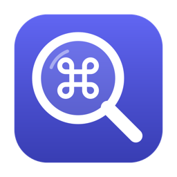

<p align="center">
  
</p>

# Shortcut Lens

Hold **⌘** for two seconds in any Mac app, and a sheet appears showing that
app's keyboard shortcuts — read live from its own menu bar. Let go and it
disappears.

This is an attempt to bring back a beloved productivity tool **"CheatSheet"** that unfortunately got discontinued. This is a more polished version that still doesn't overcomplicate things and maintains the minimalistic design language with the same functionality that everyone loved.

No configuration, no per-app setup, and nothing to maintain: the shortcuts
come from whatever app you happen to be using, so it works with apps that
didn't exist when this was written.

- **Works in any app.** Shortcuts are read from the frontmost app's real menu
  bar through the macOS Accessibility API, not from a bundled list.
- **Stays out of the way.** Holding ⌘ and pressing another key — an ordinary
  shortcut like ⌘C — cancels the sheet, so normal typing is unaffected. The
  overlay never takes keyboard focus.
- **Follows your theme.** Light and Dark Mode are handled by using system
  materials and semantic colours, with no theme switching logic.
- **Private by construction.** No network access of any kind, and keystrokes
  are never read, logged or stored. See [Privacy and security](#privacy-and-security).

## Requirements

- macOS 13 (Ventura) or later
- An Apple Silicon or Intel Mac

## Installation

There are **two ways** to install Shortcut Lens:

1. **[Download the app](#option-1-download-the-app-recommended)** — the
   easiest way, and no technical knowledge is needed. Recommended for most
   people.
2. **[Build it from source](#option-2-build-from-source)** — for developers,
   or anyone who'd rather compile the app themselves.

### Option 1: Download the app (recommended)

**Step 1 — Download.** Go to the
[latest release](https://github.com/anasaqeel/ShortcutLens/releases/latest)
and download the file named `ShortcutLens-` followed by a version number and
`.dmg`.

**Step 2 — Install.** Double-click the downloaded file. In the window that
opens, drag **Shortcut Lens** onto the **Applications** folder. You can then
close that window and eject the disk image (click ⏏ next to "Shortcut Lens"
in the Finder sidebar).

> Don't open the app from inside that window — it needs to be in your
> Applications folder to work properly. If you do open it from there, it
> will remind you to move it first.

**Step 3 — Allow it to open.** Open your **Applications** folder and
double-click **Shortcut Lens**. The first time, macOS will stop it with a
message saying it can't verify the app. That's expected (see
[why](#why-does-macos-warn-about-it) below). Click **Done** or **OK** — *not*
"Move to Trash" — and then:

1. Open **System Settings** and choose **Privacy & Security**.
2. Scroll down to the **Security** section. You'll see a message saying
   Shortcut Lens was blocked.
3. Click **Open Anyway**, enter your Mac's password if asked, and confirm
   with **Open Anyway** once more.

You only need to do this once. (The exact wording differs slightly between
macOS versions.)

**Step 4 — Let it read menus.** Shortcut Lens will explain that it needs
*Accessibility* access to read other apps' menus. Click **OK**, and in the
System Settings window that opens, switch **Shortcut Lens** on. Then quit it
— click the ⌘ icon in your menu bar and choose **Quit Shortcut Lens** — and
open it again from Applications.

**Step 5 — Try it.** Switch to any app and hold down the **⌘ Command** key
for two seconds. Let go to close the sheet.

To have it start automatically, click the ⌘ icon in the menu bar and choose
**Launch at Login**.

#### Why does macOS warn about it?

macOS shows this warning for any app that hasn't been *notarized* — checked
and approved by Apple — which requires a paid Apple Developer membership.
The warning isn't a sign that anything is wrong with Shortcut Lens, but it is
a good reminder to be careful where apps come from:

- Only download Shortcut Lens from this project's
  [Releases page](https://github.com/anasaqeel/ShortcutLens/releases).
- The app never connects to the internet, and all of its code is here for
  anyone to read.
- Each release lists a SHA-256 checksum. If you're comfortable with
  Terminal, you can check your download matches it:
  `shasum -a 256 ~/Downloads/ShortcutLens-*.dmg`

#### Updating

Download the new version and drag it into Applications, choosing
**Replace** when asked. Because each release is a different build, macOS
will treat it as a new app: repeat Step 3, then in **System Settings →
Privacy & Security → Accessibility** switch Shortcut Lens off and on again.
If it still doesn't work, select it, remove it with the **−** button, and
add it again with **+**.

### Option 2: Build from source

You'll need the Xcode Command Line Tools (`xcode-select --install`).

```sh
git clone https://github.com/anasaqeel/ShortcutLens.git
cd ShortcutLens
./Scripts/create_signing_identity.sh   # once — see Signing below
./Scripts/build_app.sh --install       # builds and installs to /Applications
```

Then open **System Settings → Privacy & Security → Accessibility**, add
`/Applications/Shortcut Lens.app`, and switch it on. Relaunch the app
afterwards — macOS only tells a process about the permission at launch.

A menu bar icon lets you re-check permission, toggle Launch at Login, or
quit.

#### Signing

`create_signing_identity.sh` creates a self-signed code-signing certificate
in your login keychain and the build signs with it. This is not about
distribution — it's about the app keeping a *stable identity*.

With ad-hoc signing (`codesign --sign -`), macOS derives the app's identity
from a hash of the binary, so every rebuild looks like a brand-new app and
silently loses the Accessibility permission you granted. A fixed certificate
produces a stable designated requirement, so the grant survives rebuilds.
The key never leaves your Mac.

> **Always run the app from `/Applications`.** Launched from an ordinary
> folder, an app signed this way is subject to *App Translocation*: macOS
> runs it from a randomised read-only copy under
> `/private/var/folders/.../AppTranslocation/<uuid>/` whose path changes on
> every launch, so Accessibility permission can never stick. `--install`
> handles this for you.

## How it works

| Component | Responsibility |
|---|---|
| [`GlobalCommandHoldMonitor`](Sources/ShortcutLens/GlobalCommandHoldMonitor.swift) | Detects "⌘ held alone for 2s" by *observing* events — it can't intercept or block them, so other apps' shortcuts are untouched. |
| [`MenuBarShortcutReader`](Sources/ShortcutLens/MenuBarShortcutReader.swift) | Walks the frontmost app's menu bar over the Accessibility API, with per-call and overall timeouts plus depth/count caps. |
| [`KeyEquivalentFormatter`](Sources/ShortcutLens/KeyEquivalentFormatter.swift) | Decodes the undocumented `AXMenuItemCmdModifiers` bitmask and turns key characters into the glyphs macOS itself draws. |
| [`ShortcutOverridesStore`](Sources/ShortcutLens/ShortcutOverridesStore.swift) | Merges a small bundled `overrides.json` for shortcuts that aren't exposed as menu items. |
| [`ShortcutLensLayout`](Sources/ShortcutLens/ShortcutLensLayout.swift) | Packs everything into a fixed-size four-column sheet, flowing menus across columns and stepping down through three text densities so it fits without scrolling. |
| [`ShortcutLensWindowController`](Sources/ShortcutLens/ShortcutLensWindowController.swift) | A borderless, non-activating panel that can never become key or steal focus. |

Two details worth knowing if you're reading the code:

- **Menu items aren't filtered by `AXEnabled`.** Items frequently report as
  disabled until their menu has been opened at least once, which would leave
  the sheet nearly empty for most apps.
- **Some keys have no drawable character.** Arrows, F-keys and similar arrive
  as AppKit's function-key constants in the Unicode Private Use Area
  (`U+F700`–`U+F8FF`), which render as `?`; Dictation arrives as the 🎤
  emoji; and the Globe/fn key is modifier bit `0x10`. These are substituted
  with SF Symbols or proper glyphs.

## Development

```sh
./Scripts/run_tests.sh          # unit tests
./Scripts/build_app.sh          # build to dist/ without installing
swift Scripts/make_icon.swift   # regenerate Resources/AppIcon.icns
```

`run_tests.sh` wraps `swift test`. With only the Command Line Tools
installed, Swift 6.4 intermittently fails to find swift-testing's macro
plugin on a clean build, so the script points the compiler at it
explicitly; with full Xcode it's a plain `swift test`.

The tests cover the pure logic: key formatting, the override merge rules,
hold/cancel/release timing (using synthetic `NSEvent`s and an injected
frontmost-app provider), and layout packing. They deliberately don't drive
the real global monitor or read a live app's menu bar — both need
Accessibility permission and a GUI session, so verify those by hand:

1. Hold ⌘ for two seconds over another app — the sheet should appear.
2. Release ⌘ — it should disappear immediately.
3. Press ⌘C quickly — the sheet must *not* appear, and copy must still work.
4. Switch between Light and Dark Mode and check the sheet follows.

### Publishing a release

```sh
./Scripts/make_dmg.sh    # -> dist/ShortcutLens-<version>.dmg and .sha256
```

This builds a universal (Apple Silicon + Intel) binary, ad-hoc signs it, and
packages it in a disk image alongside a shortcut to Applications. The
version comes from `CFBundleShortVersionString` in `Resources/Info.plist`,
so bump that (and `CFBundleVersion`) first.

Release builds are deliberately *not* signed with the local certificate
from `create_signing_identity.sh`: that certificate is trusted only on your
own Mac, so it wouldn't get past Gatekeeper anywhere else either, and it
would tie every release to one machine. Ad-hoc signing is reproducible by
anyone.

Then on GitHub, open **Releases → Draft a new release**, create a tag
`v<version>`, attach both the `.dmg` and the `.sha256` file, and paste the
checksum into the release notes.

## Privacy and security

- **Read-only.** The app only reads Accessibility data (menu titles and key
  equivalents) and observes the ⌘ key's state. It never synthesises
  keystrokes, sends Apple Events, or modifies another app.
- **Not a keylogger.** To tell a real shortcut from an idle ⌘ hold it only
  needs to know that *some* key was pressed. It never reads
  `event.characters` or `event.keyCode`, so what you type is never captured.
- **No network, no analytics, no persistence** beyond the Launch at Login
  registration you opt into from the menu bar.
- **Hostile input is bounded.** Menu data comes from other processes, so
  every Accessibility call is time-limited, the tree walk is depth- and
  count-capped, and strings are length-capped — a frozen, enormous or
  malicious app can't hang the sheet or exhaust memory.
- The bundled `overrides.json` is read-only inside the app bundle: it is
  never fetched remotely and never written to.

## Limitations

- Only shortcuts that appear in an app's menu bar are discovered. Anything
  bound purely in-app (many of VS Code's, for instance) won't show unless
  added to `overrides.json`.
- On a laptop display, apps with very large menu bars (Xcode) still need to
  scroll; the layout widens to six columns before that happens.
- Downloads aren't notarized — that needs a paid Apple Developer ID — so
  macOS blocks the app the first time it's opened until you choose
  **Open Anyway** (see [Option 1](#option-1-download-the-app-recommended)),
  and each update needs its Accessibility permission re-enabled.

## License

[MIT](LICENSE)
